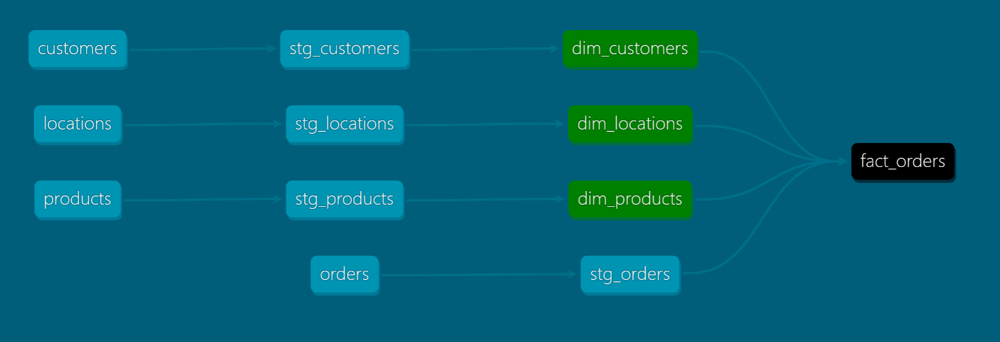

Project that contains the basic data ingestion and transformations with DBT.

The folder seeds contains the excel files that serve as data source. They are being loaded into the Staging Layer (first layer of the warehouse), and then to the Mart Layer (where the Star Schema is created). 

The folder model contains 2 folders, one per each layer. Each of these folders contain the SQL script to create the tables and load the data into these layers. They also contain the schema.yml files that define each layer, table and attribute. There, basic tests are also defined (mostly to check if attributes are fully NULL or not).

The folder my_database_scheduler has been created thanks to dagster which is used as an scheduler. Library used is dagster-dbt.

The file dev.duckdb is the database itself that contains the data already loaded.

The Star Schema comprises 2 dimensions (dim_customers and dim_locations) and 1 fact table (fact_orders) where the orders information is stored. The fact table joins the data from the dimensions, making it ready for consumption by any BI tool (see image below).
There is an extra dimension (dim_products). This dimension is created to have a unique list of products available from all the orders. A surrogate key is generated as a primary key.

